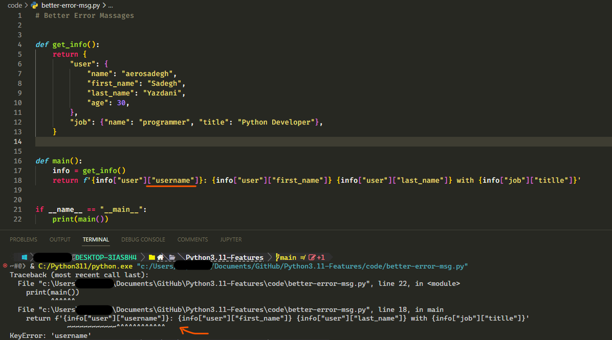
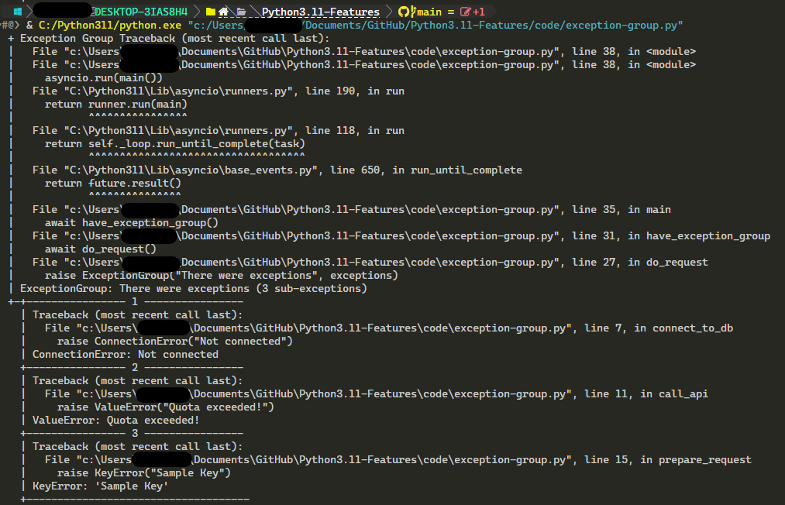
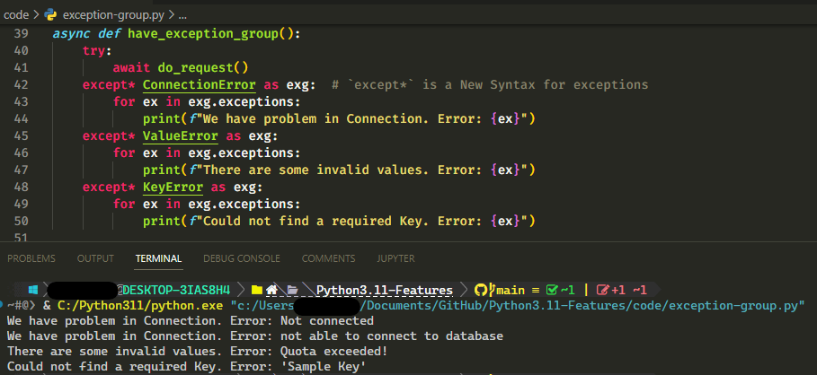

# Python3.11 Features

### 1. Better Error Messages 
 Now we have more information about location of error!

### 2. Exception Group 
For the async codes we have `ExceptionGroup` !

We have also new syntax `except*` for catching same exceptions in exception group!
