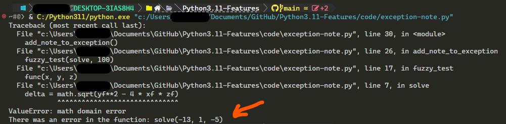
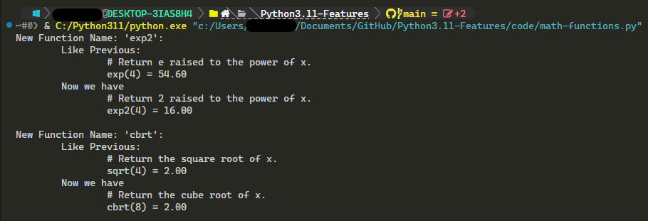
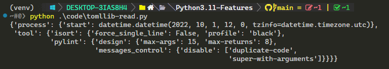

# Python3.11 Features

### 1. Better Error Messages 
 Now we have more information about location of error!

### 2. Exception Group 
 For the async codes we have **Exception Group** !

We have also new syntax `except*` for catching same exceptions in exception group!

### 3. Add Note to Exception
 Now, We can add informative note to the exception with `add_note`.

### 4. New `math` Functions
 Now, We have two new functions `math.exp2` and `math.cbrt`.

### 5. New Module for TOML file
 Now, We have new module that can load and dump `.toml` files
